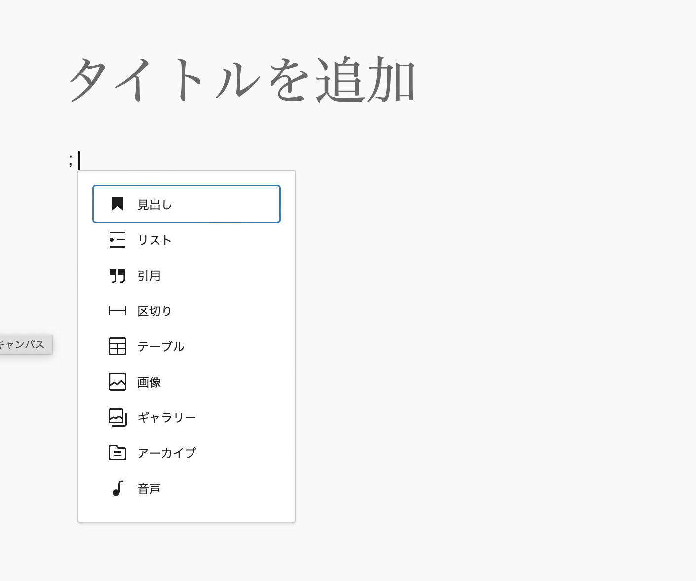

# Gutenberg Japanese Extension
「Gutenberg Japanese Extension」はWordPressのビジュアルエディターGutenbergの日本語向け拡張です。

## 導入
GitHubのリリース機能でzipをダウンロードし、WordPressにインストールしてください。

## 機能
日本語でGutenbergを使用していて困るのが、「/」やマークダウン記法を使用する際の全角・半角の切り替えです。このプラグインは全角のままでも「/」やマークダウン記法を使えるようにします。

### 全角セミコロンでの「/」コマンド呼び出し
Gutenbergでは「/」を入力することでブロックを選択するUIを表示できますが、このプラグインを使用すると「；」で同等の機能を呼び出せます。


### 全角マークダウン
このプラグインでは、一部のマークダウン記法が全角で使用できます。

| 種類      | 記法                                                                |
|---------|-------------------------------------------------------------------|
| 引用      | ```＞```（全角）                                                       |
| 見出し     | ```＃```, ```＃＃```, ```＃＃＃```（全角シャープ；見出し6まで）                       |
| 箇条書き    | ```＊```（全角アスタリスク）, ```＋```（全角プラス）, ```ー```（全角伸ばし棒）, ```・```（全角中点） |
| 番号付きリスト | ```1。```（全角1＋句点）, ```1）```（全角1＋丸かっこ）                              |
| 区切り線    | ```ーーー```（全角伸ばし棒3つ）                                               |


## ライセンス
このプラグインはGNU Public License Version 2(GPLv2)のもと公開されます。詳細は[LICENSE.txt](LICENSE.txt)をご覧ください。